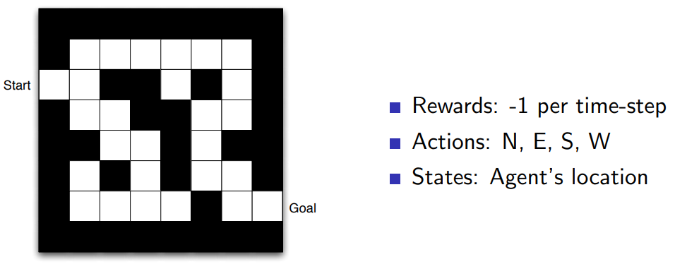
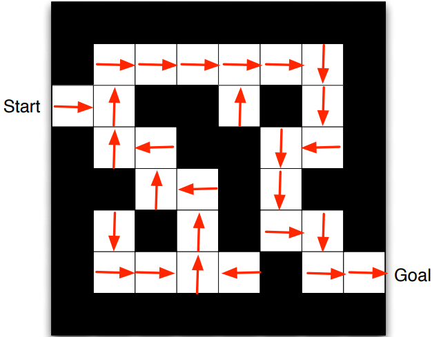
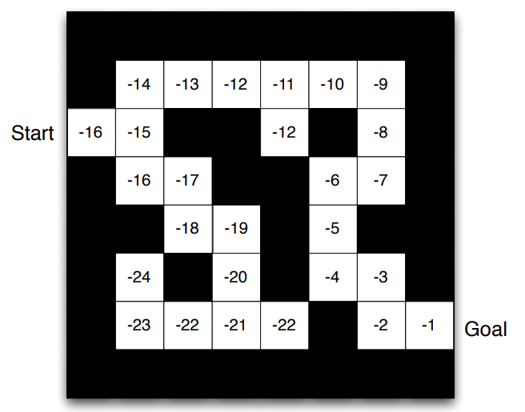

# Lecture 1: Giới thiệu về Reinforcement Learning
## Reinforcement learning (RL) là gì?
RL, hay còn gọi là học tăng cường, là một nhánh của học máy (Machine Learning). Một bài toán RL bao gồm các thành phần: 
- Agent (tác tử): có thể hiểu là một con robot (hay đại loại thế) có thể tương tác với môi trường xunh quanh nó nhắm thực hiện một task nào đó (thường thì môi trường sẽ là giả lập trong quá trình huấn luyện)
- Environment (môi trường): là thứ mà agent tương tác trong lúc hoạt động, bao gồm hữu hạn hoặc vô hạn các trạng thái, các trạng thái này sẽ chuyển đổi lẫn nhau do tác động của agent.
- Rewards (phần thưởng): là phần thưởng mà agent nhận được mỗi khi tương tác với môi trường, là feedback để agent biết độ tốt/xấu của hành động của mình. Rewards được quy định khác nhau tùy theo từng bài toán RL và chiến thuật tối ưu hóa.
- Policy (chiến lược - chính sách): là "bộ não" của agent, giúp nó ra quyết định trong mỗi lần tương tác.
- States (trạng thái): là tập các trạng thái của environment, được hiểu theo nghĩa rộng, có thể là bất kì thứ gì có thể đại diện (represent) cho trạng thái của environment. Ví dụ đơn giản là bạn thử nghĩ xem có bao nhiêu cách để biểu diễn *trạng thái* của một vật bất kì? 

Ví dụ một bài toán RL cơ bản như: một robot tìm cách đi đến một ví trí nào đó trong mê cung mà không chạm tường. Agent sẽ là con robot, environment là môi trường (có thể giả lập) gồm các bức tường, mặt đường, đích đến. Rewards có thể được quy định là: nếu chạm vào tường sẽ bị trừ 1 điểm, đến được target sẽ được cộng 1 điểm, đi mỗi bước sẽ bị trừ 0.1 điểm. State tại mỗi vị trí có thể là tọa độ (x, y) trong không gian 2D của agent. Trong quá trình huấn luyện, con robot sẽ được thả vào mê cung và đi tự do, tự ra quyết định thông qua một policy khởi tạo. Bằng các thuật toán tối ưu, con robot sẽ lợi dụng những rewards mà nó nhận được sau những lần đi để tối ưu policy của nó, và dần dần nó sẽ đi khôn hơn.

> RL khác với bài toán Supervised trong ML thế nào?
- Không có supervisor, chỉ có rewards làm feedback
- Feedback nhận được thường bị delayed, chứ không ngay lập tức. Ví dụ như con robot phải đi đến khi nào nó đâm vào tường hay đến đích thì mới nhận được feedback.
- Thời gian là một yếu tố quan trọng, các dữ liệu sample thu được trong quá trình huấn luyện không phải đồng nhất độc lập (identical independent distribution) như thường thấy trong supervised learning.

#### Rewards
Một reward  là một số thực, biểu diễn mức độ tốt xấu của hành động thứ t của agent, hay của hành động của agent tại *timestep* thứ t. Mục tiêu của agent sẽ là tối ưu lượng rewards nhận được trên đường đi của mình (tổng reward lại tất cả timestep)

Có một giả thuyết về rewards:
> All goals can be described by the maximisation of expected cumulative reward
> 
tức là mọi mục tiêu cũng có thể được quy về bài toán tối đa hóa tổng tích lũy rewards.

#### Sequential Decision Making
Mục tiêu của agent cũng có thể hiểu là chọn được action phù hợp tại các timestep liên tục, nói cách khác, chọn ra một **chuỗi** các actions sao cho tổng tích lũy rewards là lớn nhất. 
Quay lại với bài toán trong ví dụ đầu bài viết, tại mỗi thời điểm t, policy phải giúp agent chọn ra action , aka đi thẳng, rẽ trái một góc alpha, rẽ phải một góc beta, ... sao cho sau khi thực hiện nó thì nó sẽ chuyển sang một state mới mà **từ đó trở đi** cuộc đời sẽ tươi đẹp hơn, aka dễ dàng chọn ra các action đem lại reward cao. 
Chính vì thế, có thể rút ra ba điều:
- Reward có thể bị delay, vì tại mỗi step thì agent đều cố gắng maximize lượng rewards tích lũy trong tương lai, hay còn gọi là accumulate future rewards, nhưng nó lại không được biết nó nhận được giá trị này ngay sau khi nó thực hiện action nó đưa ra.
- Action mà agent đưa ra trong mỗi step ảnh hưởng tới những quyết định tiếp theo, bởi nó đưa agent sang một trạng thái khác.
- Một policy tốt có nghĩa là đôi khi agent phải hi sinh lượng reward tức thời, để có được tổng tích lũy rewards cao nhất.

#### States
Có hai loại states: environment states và agent states. 
- Environment states là những trạng thái thuộc tập trạng thái ẩn của môi trường, gồm vô số (gần như là vô hạn) thông tin mà agent thường sẽ không thể tiếp thu được hết. Những trạng thái này được environment sử dụng để quyết định trạng thái chuyển đổi tiếp theo mỗi khi tiếp nhận một tác động nào đó từ bên ngoài, hay action từ agent. 
- Agent states (observation): là những trạng thái, hay chính xác hơn là biểu diễn mà agent tiếp thu được từ môi trường, thứ mà policy sẽ sử dụng để đưa ra action mà agent sẽ thực hiện.

Một ví dụ đơn giản như hình ảnh mà chúng ta đang nhìn thấy chính là internal observation của chúng ta với thế giới xung quanh. Thứ chúng ta nhìn đấy chẩng qua chỉ chứa một lượng thông tin cực kì nhỏ so với trạng thái của thế giới. Chúng ta có thể nhìn thấy một quả bóng nhưng không thể biết bên trong nó đang có hàng nghìn chuyển động, phản ứng của các phân tử.

Sau khi agent thực hiện một chuỗi hành động, ta có thể xây dựng một chuỗi gọi là history (hay trajectory) của agent:

tức là tại thời điểm t, agent đang ở trạng thái  và sau khi thực hiện action  thì thu được reward tương ứng .

Quá trình chuyển đổi từ state này qua state khác được quyết định bởi environment thông qua một hàm, hay phân bố xác suất P: 

Một state được gọi là Markov khi nó chỉ phụ thuộc vào state ngay trước đó, aka tương lai sẽ độc lập với quá khứ khi biết hiện tại, aka: 

Trong những bài toán mà agent states = environment states và có tính Markov tại mọi thời điểm, ta quy về họ bài toán Markov Decision Process. Còn trong những bài toán mà agent states < environment states, hay agent tương tác với một Partially Observable Environments, agent sẽ cần phải tự xây dựng một biểu diễn trạng thái của mình, thường thì việc này sẽ thông qua một thứ gọi là **Model**. Model sẽ được agent dùng để dự đoán sự thay đổi của environment, bao gồm cả state tại bước tiếp theo lẫn reward tại bước hiện tại.

#### Policy
Như đã nói, policy, kí hiệu là , là thứ giúp agent đưa ra action phù hợp khi đã biết state hiện tại. 
Có hai loại policy: 
- Deterministic (đơn định): , tức là một mapping từ state sang action.
- Stochastic (ngẫu nhiên): , tức là action sẽ được chọn một cách **ngẫu nhiên có xác suất**

#### Value Function

Value function (hàm giá trị), là một đại lượng biểu diễn **dự đoán** của tổng tích lũy phần thưởng trong tương lai, và được dùng để đánh giá mức độ tốt/xấu của một state.

với  được gọi là giá trị chiết khấu (discounted factor), thường sẽ nằm trong khoảng từ 0 đến 1, nhằm mục đích làm giảm sự quan trọng ở những dự đoán xa hơn vì những dự đoán tương lai xa sẽ nhiều khả năng sai hơn. Tại sao phải cần quan tâm đến mức độ sai đúng? Ví dụ tại một step t nào đó agent muốn dùng  để cập nhật policy của mình, nên nhớ giá trị này chỉ là **dự đoán** vì lúc đó agent không thể biết trước được tương lai, việc sai lệch sẽ khiến cho quá trình cập nhật bị sai hướng và làm giảm tốc độ học của agent.

Ví dụ:

#### Phân loại các RL Agents
- Valued-based: agent sẽ cố gắng tối ưu value function và từ đó suy ra policy
- Policy-based: agent sẽ cố gắng xấp xỉ trực tiếp policy của nó, phân bố xác suất 
- Actor-critic: agent sẽ học phụ thuộc vào cả value function và policy, vừa tối ưu value function và dùng value function để cập nhật policy.

#### Exploration và exploitation
- RL là một quá trình học bằng cách thử, trial-and-error
- Exploration nghĩa là agent sẽ cố gắng mở rộng phạm vi tương tác, thu thập thêm nhiều thông tin về environment.
- Exploitation nghĩa là agent sẽ lợi dụng thông tin hiện có, aka các tương tác kèm theo feedback nhận được, để dần dần hình thành chiến lược policy.

Trong quá trình học của agent, cả exploration và exploitation đều quan trọng, và việc cân bằng giữa 2 việc này là một điều cần chú ý. Đơn cử như trường hợp con robot tìm được đường đi đến đích và đã đi tốt trên đường này, nếu nó quyết định chỉ nghiêng về exploitation thì nó sẽ mãi đi đường này. Mặc khác, nếu nó hi sinh reward trong một vài lần để thực hiện exploration, khám phá thêm các đường khác thì nó lại tìm được đường khác gần hơn, aka tổng reward cao hơn.