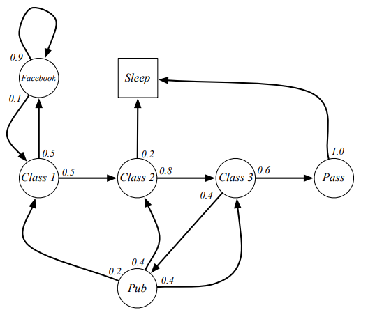
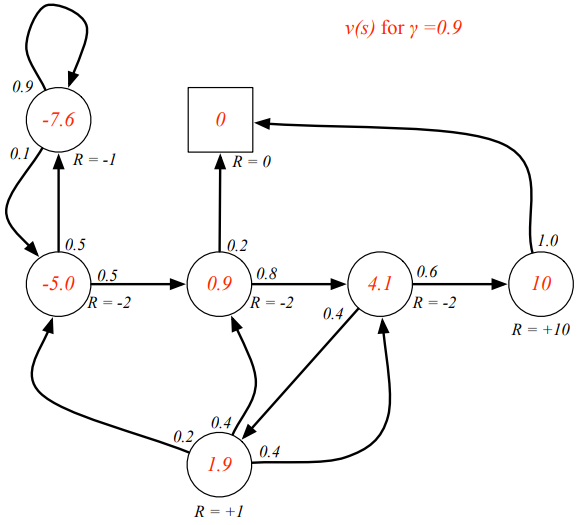
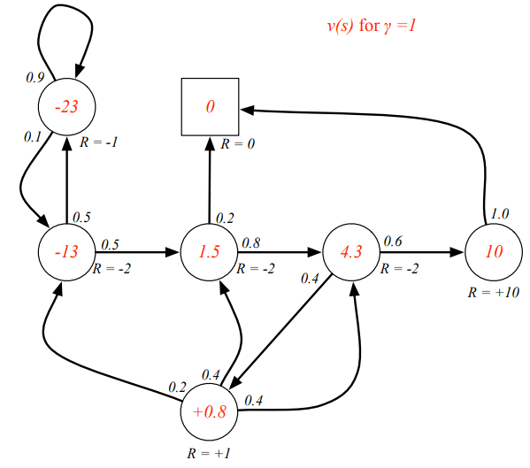

# Lecture 2: Markov Decision Process
## Giới thiệu về MDP
- Một MDP thường mô tả một môi trường trong bài toán Reinforcement Learning (RL)
- Khi mà môi trường có thể quan sát đầy đủ (fully observable), tức là observation của agent cũng chính là state của environment
- Gần như tất cả các bài toán RL đều có thể đưa về dạng MDP

## Tính chất Markov
> Tương lai luôn độc lập với quá khứ khi biết được trạng thái hiện tại.
> 
Một trạng thái  được coi là có tính chất Markov nếu:

tức là trạng thái này *captures* được tất cả các thông tin liên quan từ quá khứ và một khi biết trạng thái này, các trạng thái quá khứ có thể bỏ đi.

## Ma trận chuyển đổi trạng thái
Nếu ai đã biết qua về Markov Model thì có lẽ không xa lạ với khái niệm Ma trận chuyển đổi trạng thái (State Transition Matrix). Nó là một ma trận ghi lại những xác suất chuyển đổi giữa các cặp trạng thái trong một tập trạng thái hữu hạn.

với $P[i][j]$ là xác suất chuyển đổi từ trạng thái $i$ sang trạng thái $j$.
## Markov process
Một quy trình Markov (Markov Process) là một quy trình ngẫu nhiên không có bộ nhớ (memoryless random process), tức là một chuỗi các trạng thái có tính Markov 

***Definition***
Một quy trình Markov (hay chuỗi Markov) là một bộ (S, P):
- S là một tập hữu hạn các trạng thái có tính Markov
- P là ma trận chuyển đổi trạng thái

Dưới đây là một ví dụ về một quy trình Markov. Từ biểu diễn dưới đây, các chuỗi Markov, hay có thể gọi là **episode** (một chuỗi trạng thái từ lúc bắt đầu đến khi kết thúc), với trạng thái bắt đầu là C1 có thể là:
- C1 C2 C3 Pass Sleep
- C1 FB FB C1 C2 Sleep
- C1 C2 C3 Pub C2 C3 Pass Sleep
- C1 FB FB C1 C2 C3 Pub C1 FB FB FB C1 C2 C3 Pub C2 Sleep

Dễ dàng nhận ra trong tập trạng thái này, Sleep là trạng thái kết thúc.

## Markov Reward Process (MRP)

Một quy trình có phần thưởng Markov (Markov Reward Process) là một chuỗi Markov kèm theo giá trị phần thưởng (obviously :D)

***Definition***
Một quy trình phần thưởng Markov là một bộ :
- S là một tập hữu hạn các trạng thái có tính Markov
- P là ma trận chuyển đổi trạng thái và 
- R là hàm giá trị phần thưởng (reward function), tức  
-  là giá trị chiết khấu (discounted factor) thuộc khoảng [0, 1]

Quay trở lại với ví dụ trước:

Có thể thấy là tên này rất thích đi Pub và ngủ mà vẫn được qua môn :D 
## Return
***Definition***

Giá trị hồi đáp (return)  là tổng giá trị phần thưởng có chiết khấu tính từ thời điểm t,

như đã giải thích ở lecture 1, giá trị discounted value được chọn sao cho phù hợp với bài toán, khi giá trị này gần 0 thì hàm return được gọi là "cận thị" (myopic), tức là chỉ nhìn/dự đoán được reward trong tương lại cực gần. Ngược lại, nếu giá trị này gần 1, hàm return được coi là có tầm nhìn xa (far-sighted).

Lí do tồn tại của discounted value là:
- Tránh trường hợp return trả lại là vô cùng (infinite) do bị rơi vào vòng lặp trong chuỗi Markov.
- Những lỗi dự đoán gây ra bởi độ không chắc chắn (uncertainty) trong tương lai xa sẽ được giảm bớt.
- Có thể tùy chỉnh mục đích của bài toán. Ví dụ, trong bài toán tài chính, phần thưởng tức thời (immediate rewards) được đánh giá cao hơn.

## Value function
***Definition***
Hàm giá trị (Value Function) v(s) của một MRP là giá trị kì vọng của return từ trạng thái s,

Quay trở lại ví dụ của chúng ta, ta có thể tính được value function cho trạng thái C1 trong các episode được lấy:

Biểu diễn value function trên đồ thị với các giá trị khác nhau của discounted value:

Câu hỏi đặt ra là làm sao từ đồ thị ban đầu và chưa có episode nào ta có thể tính được các giá trị đó? Câu trả lời nằm ở Bellman Equation.

## Bellman equantion trong MRPs

Một giá trị value của value function có thể được phân giải thành 2 phần:
- phần thưởng tức thời $R_{t+1}$
- value function của state tiếp theo có chiết khấu $\gamma * V(S_{t+1})$

![gif.latex?v%28s%29%20%5C%5C%20%3D%20E%5BG_t%20%7C%20S_t%20%3D%20s%5D%20%5C%5C%20%3D%20E%5BR_%7Bt&plus;1%7D%20&plus;%20%5Cgamma%20R_%7Bt&plus;2%7D%20&plus;%20%5Cgamma%5E2R_%7Bt&plus;3%7D%20&plus;%20...%20%7C%20S_t%20%3D%20s%5D%5C%5C%20%3D%20E%5BR_%7Bt&plus;1%7D%20&plus;%20%5Cgamma%20%28R_%7Bt&plus;2%7D%20&plus;%20%5Cgamma%20R_%7Bt&plus;3%7D%20&plus;%20...%29%20%7C%20S_t%20%3D%20s%5D%5C%5C%20%3D%20E%5BR_%7Bt&plus;1%7D%20&plus;%20%5Cgamma%20G_%7Bt&plus;1%7D%20%7C%20S_t%20%3D%20s%5D%5C%5C%20%3D%20E%5BR_%7Bt&plus;1%7D%20&plus;%20%5Cgamma%20v%28S_%7Bt&plus;1%7D%29%20%7C%20S_t%20%3D%20s%5D](https://latex.codecogs.com/gif.latex?v%28s%29%20%5C%5C%20%3D%20E%5BG_t%20%7C%20S_t%20%3D%20s%5D%20%5C%5C%20%3D%20E%5BR_%7Bt&plus;1%7D%20&plus;%20%5Cgamma%20R_%7Bt&plus;2%7D%20&plus;%20%5Cgamma%5E2R_%7Bt&plus;3%7D%20&plus;%20...%20%7C%20S_t%20%3D%20s%5D%5C%5C%20%3D%20E%5BR_%7Bt&plus;1%7D%20&plus;%20%5Cgamma%20%28R_%7Bt&plus;2%7D%20&plus;%20%5Cgamma%20R_%7Bt&plus;3%7D%20&plus;%20...%29%20%7C%20S_t%20%3D%20s%5D%5C%5C%20%3D%20E%5BR_%7Bt&plus;1%7D%20&plus;%20%5Cgamma%20G_%7Bt&plus;1%7D%20%7C%20S_t%20%3D%20s%5D%5C%5C%20%3D%20E%5BR_%7Bt&plus;1%7D%20&plus;%20%5Cgamma%20v%28S_%7Bt&plus;1%7D%29%20%7C%20S_t%20%3D%20s%5D)

Bellman Equation có thể được diễn giải bằng phép nhân ma trận:  hay chính là:

Có thể thấy Bellman Equation là một phương tình tuyến tính và có thể giải trực tiếp bằng cách biến đổi:

Độ phức tạp tính toán là  với n trạng thái, nên chỉ dùng với những bài toán MRP nhỏ. Với những bài toán ứng bới MRP lớn hơn, có nhiều phương pháp khác để tìm (hay xấp xỉ) của hàm giá trị như:
- Dynamic Programming
- Monte-Carlo evaluation
- Temporal-Difference learning

## Markov Decision Process
Có thể bạn sẽ thắc mắc tại sao suốt từ đầu lecture đến giờ không có sự xuất hiện của tập các actions, thì câu trả lời là nó nằm ở Markov Decision Process (MDP). Một quy trình Markov quyết định là một quy trình Markov có phần thưởng và kèm theo các hành động (hay các quyết định). Nó là một môi trường mà tất cả trạng thái đều có tính Markov.

***Definition***
Một MDP được biểu diễn bằng một tuple , trong đó:
- S là một tập hữu hạn các trạng thái có tính Markov
- P là ma trận chuyển đổi trạng thái và 
- A là tập hữu hạn các hành động
- R là hàm giá trị phần thưởng (reward function), tức  
-  là giá trị chiết khấu (discounted factor) thuộc khoảng [0, 1]

## Policies 

Policy  của một MDP là một phân phối có điều kiện trên tập actions và states:

- Cho một MDP  và một policy 
- Chuỗi các state vầ reward  là một MRP  với
 

## Value function 

Hàm state-value  của một MDP là giá trị expected returnn từ trạng thái s và đi theo policy :

Tương tự, ta cũng định nghĩa ra hàm action-value , là giá trị expected returnn từ trạng thái s, thực hiện action a và sau đó đi theo policy :

Và ta cũng có thể áp dụng Bellman Equation với MDP:

Mối quan hệ giữa hàm state-value và action-value được thể hiện bởi công thức:

mặt khác, do:

nên ta có:

và:

Hơi rắc rối một chút, nhưng ta đã có được hai công thức Bellman Equation của state-value và action-value function :D

Biểu diễn dưới dạng ma trận và phương pháp giải Bellman Equation của MDP cũng tương tự như với MRP.

## Optimal Value Function

Hàm state-value tối ưu tại một trạng thái là hàm giá trị có giá trị lớn nhất tại trạng thái đó trên toàn bộ các policies:

tương tự với action-value function:

Một bài toán MDP coi là "được giải" khi ta tìm được các hàm tối ưu trên.

## Optimal policy

Ta kí hiệu rằng: 

Với mọi MDP:
- Có một optimal policy tốt hơn hoặc bằng tất cả các policy khác: 

- Tất cả các optimal policy đều đưa đến optimal value function: 

## Finding the optimal policy 

Có thể tìm optimal policy bằng cách maximize hàm action-value trên các cặp state và action:

do đó, nếu ta biết được optimal action-value function, ta có thể tìm ra ngay optimal policy.

## Bellman Optimality Equation 

Bellman equation cũng áp dụng cho cả các optimal function, mình sẽ để cho mọi người tự hình dung ra nhé :D

## Extensions to MDPs

- Infinite and continuous MDPs.
- Partially observable MDPs.
- Undiscounted, average rewards MDPs.